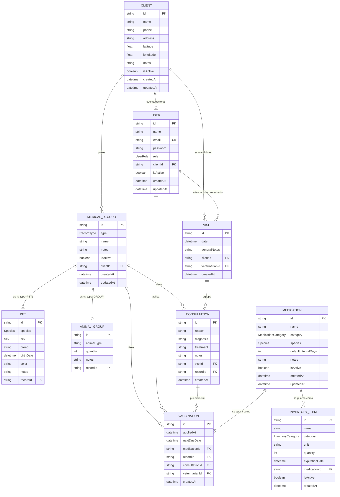
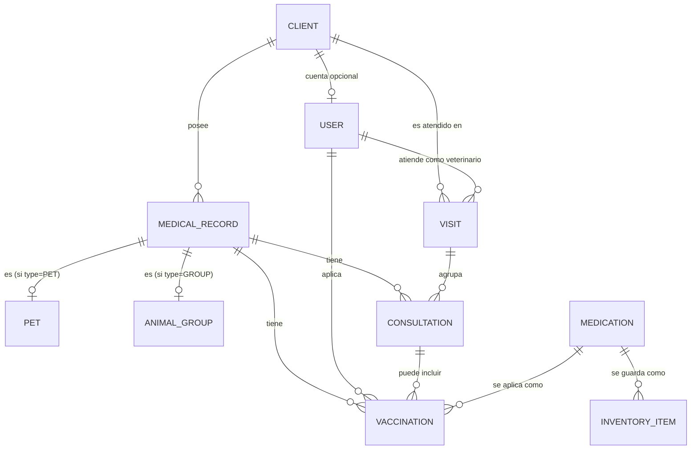

# 🐾 Sistema de Gestión Veterinaria
## Modelo de Datos — MVP1 (Actualizado y Escalable)

---

## 1. Principios de Diseño

- La **Visita** es el evento de atención del cliente
- La **Consulta** es la atención específica por animal dentro de una visita
- Una visita puede tener 0, 1 o múltiples consultas (múltiples animales)
- Una **Vacunación puede existir sin consulta**
- Todo evento clínico pertenece a una **Cartilla**
- El **Inventario** es independiente del historial clínico
- **Cliente ≠ Usuario**
- Un cliente **puede** tener cuenta de acceso (opcional)
- El diseño permite **registro de clientes en el futuro sin refactor**

---

## 2. Roles del Sistema

| Rol | Descripción |
|---|---|
| ADMIN | Administración total del sistema |
| VETERINARIAN | Registro y consulta clínica |
| CLIENT | Consulta de información propia |

---

## 3. Entidades del Sistema

---

## 👤 User

Representa una cuenta de acceso al sistema.

| Campo | Tipo | Obligatorio | Descripción |
|---|---|---|---|
| id | UUID | ✅ | Identificador único |
| name | String | ✅ | Nombre del usuario |
| email | String | ✅ | Correo (login) |
| password | String | ✅ | Contraseña cifrada |
| role | Enum | ✅ | ADMIN / VETERINARIAN / CLIENT |
| clientId | UUID | ❌ | Cliente asociado (solo rol CLIENT) |
| isActive | Boolean | ✅ | Usuario activo |
| createdAt | DateTime | ✅ | Fecha de creación |
| updatedAt | DateTime | ✅ | Última actualización |

### Reglas
- Usuarios ADMIN y VETERINARIAN **no tienen** `clientId`
- Usuarios CLIENT **siempre** tienen `clientId`
- Un usuario CLIENT solo puede ver información de su cliente

---

## 👥 Client

Representa al cliente del negocio veterinario.

| Campo | Tipo | Obligatorio | Descripción |
|---|---|---|---|
| id | UUID | ✅ | Identificador |
| name | String | ✅ | Nombre del cliente |
| phone | String | ✅ | Teléfono |
| address | String | ❌ | Dirección |
| latitude | Float | ❌ | Latitud de ubicación |
| longitude | Float | ❌ | Longitud de ubicación |
| notes | String | ❌ | Observaciones |
| isActive | Boolean | ✅ | Cliente activo |
| createdAt | DateTime | ✅ | Fecha de creación |
| updatedAt | DateTime | ✅ | Última actualización |

### Reglas
- Un cliente puede existir sin cuenta de usuario
- Un cliente puede tener **máximo una** cuenta asociada
- Los clientes nunca se eliminan (solo se desactivan)
- Los campos `latitude` y `longitude` permiten geolocalización del cliente
- La latitud debe estar entre -90 y 90 grados
- La longitud debe estar entre -180 y 180 grados

### Ejemplo de Creación
```json
{
  "name": "Juan Pérez",
  "phone": "1234567890",
  "address": "Calle 123, Ciudad",
  "latitude": 19.4326,
  "longitude": -99.1332,
  "notes": "Cliente frecuente"
}
```

---

## 📘 MedicalRecord (Cartilla)

Expediente clínico de una mascota o grupo.

| Campo | Tipo | Obligatorio | Descripción |
|---|---|---|---|
| id | UUID | ✅ | Identificador |
| type | Enum | ✅ | PET / GROUP |
| name | String | ✅ | Nombre de mascota o grupo |
| notes | String | ❌ | Observaciones |
| isActive | Boolean | ✅ | Cartilla activa |
| clientId | UUID | ✅ | Cliente propietario |
| createdAt | DateTime | ✅ | Fecha de creación |
| updatedAt | DateTime | ✅ | Última actualización |

---

## 🐶🐱 Pet

Información específica cuando la cartilla es de tipo PET.

| Campo | Tipo | Obligatorio | Descripción |
|---|---|---|---|
| id | UUID | ✅ | Identificador |
| species | Enum | ✅ | DOG / CAT |
| sex | Enum | ❌ | MALE / FEMALE |
| breed | String | ❌ | Raza |
| birthDate | DateTime | ❌ | Fecha de nacimiento |
| color | String | ❌ | Color o señas |
| notes | String | ❌ | Observaciones |
| recordId | UUID | ✅ | Cartilla asociada |

---

## 🐄🐔 AnimalGroup

Información específica cuando la cartilla es de tipo GROUP.

| Campo | Tipo | Obligatorio | Descripción |
|---|---|---|---|
| id | UUID | ✅ | Identificador |
| animalType | String | ✅ | Bovino, porcino, gallina, etc. |
| quantity | Int | ✅ | Cantidad |
| notes | String | ❌ | Observaciones |
| recordId | UUID | ✅ | Cartilla asociada |

---

## 📅 Visit (Visita)

Evento de atención del cliente. Agrupa las consultas de una misma visita.

| Campo | Tipo | Obligatorio | Descripción |
|---|---|---|---|
| id | UUID | ✅ | Identificador |
| date | DateTime | ✅ | Fecha de la visita |
| generalNotes | String | ❌ | Notas generales de la visita |
| clientId | UUID | ✅ | Cliente atendido |
| veterinarianId | UUID | ✅ | Veterinario que atendió |
| createdAt | DateTime | ✅ | Fecha de creación |

### Reglas
- Una visita puede tener 0, 1 o múltiples consultas
- Visita sin consultas = atención general (asesoría, venta de productos)
- Múltiples consultas = atención de varios animales en una sola visita

---

## 🩺 Consultation

Atención específica por animal dentro de una visita.

| Campo | Tipo | Obligatorio | Descripción |
|---|---|---|---|
| id | UUID | ✅ | Identificador |
| reason | String | ❌ | Motivo de la consulta |
| diagnosis | String | ❌ | Diagnóstico |
| treatment | String | ❌ | Tratamiento |
| notes | String | ❌ | Notas adicionales |
| visitId | UUID | ✅ | Visita a la que pertenece |
| recordId | UUID | ✅ | Cartilla atendida |
| createdAt | DateTime | ✅ | Fecha de creación |

### Reglas
- Siempre pertenece a una visita
- Siempre está asociada a una cartilla (animal o grupo)
- La fecha y veterinario se obtienen de la visita padre

---

## 💊 Medication (Catálogo Clínico)

Incluye vacunas y otros medicamentos.

| Campo | Tipo | Obligatorio | Descripción |
|---|---|---|---|
| id | UUID | ✅ | Identificador |
| name | String | ✅ | Nombre |
| category | Enum | ✅ | VACCINE / ANTIBIOTIC / OTHER |
| species | Enum | ❌ | Especie objetivo |
| defaultIntervalDays | Int | ❌ | Intervalo sugerido |
| notes | String | ❌ | Observaciones |
| isActive | Boolean | ✅ | Medicamento activo |
| createdAt | DateTime | ✅ | Fecha de creación |
| updatedAt | DateTime | ✅ | Última actualización |

---

## 💉 Vaccination

Registro de aplicación de una vacuna.

| Campo | Tipo | Obligatorio | Descripción |
|---|---|---|---|
| id | UUID | ✅ | Identificador |
| appliedAt | DateTime | ✅ | Fecha de aplicación |
| nextDueDate | DateTime | ❌ | Próxima aplicación |
| medicationId | UUID | ✅ | Vacuna aplicada |
| recordId | UUID | ✅ | Cartilla |
| consultationId | UUID | ❌ | Consulta asociada |
| veterinarianId | UUID | ✅ | Usuario que aplicó |
| createdAt | DateTime | ✅ | Fecha de creación |

---

## 📦 InventoryItem

Inventario físico (medicamentos y material).

| Campo | Tipo | Obligatorio | Descripción |
|---|---|---|---|
| id | UUID | ✅ | Identificador |
| name | String | ✅ | Nombre del artículo |
| category | Enum | ✅ | MEDICATION / MATERIAL |
| unit | String | ✅ | Unidad (pz, ml, caja) |
| quantity | Int | ✅ | Cantidad disponible |
| expirationDate | DateTime | ❌ | Caducidad |
| medicationId | UUID | ❌ | Medicamento asociado |
| isActive | Boolean | ✅ | Artículo activo |
| createdAt | DateTime | ✅ | Fecha de creación |

---

## 4. Relaciones



### Diagrama simplificado (solo entidades y relaciones)



- Client → Visit (1 a muchos)
- Client → MedicalRecord (1 a muchos)
- Visit → Consultation (1 a muchos)
- MedicalRecord → Consultation (1 a muchos)
- MedicalRecord → Vaccination (1 a muchos)
- Consultation → Vaccination (1 a muchos, opcional)
- Vaccination → Medication (muchos a 1)
- Medication → InventoryItem (1 a muchos, opcional)
- Client ↔ User (1 a 0..1)
- User (veterinario) → Visit (1 a muchos)
- Una cartilla es **PET o GROUP**, nunca ambas
- Una visita puede tener 0, 1 o N consultas

---

## 5. Reglas Clave del Sistema

- Cliente y usuario son entidades distintas
- Un cliente puede tener cuenta o no
- Un usuario CLIENT solo accede a su información
- Las consultas no son obligatorias para vacunar
- El inventario no modifica el historial clínico
- No existen recordatorios como entidad

---

## 6. Preparado para el Futuro

- ✅ Registro de clientes (Opción B) sin refactor
- ✅ Inventario avanzado
- ✅ Tratamientos y recetas
- ✅ Notificaciones automáticas
- ✅ Acceso de clientes a la app

